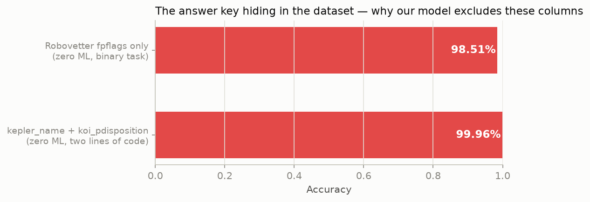
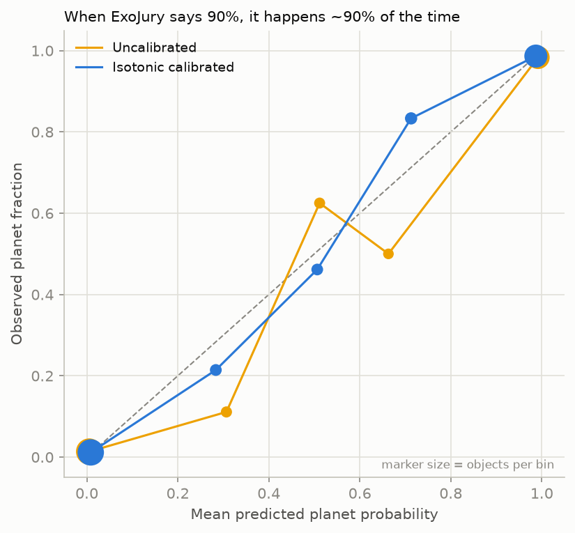
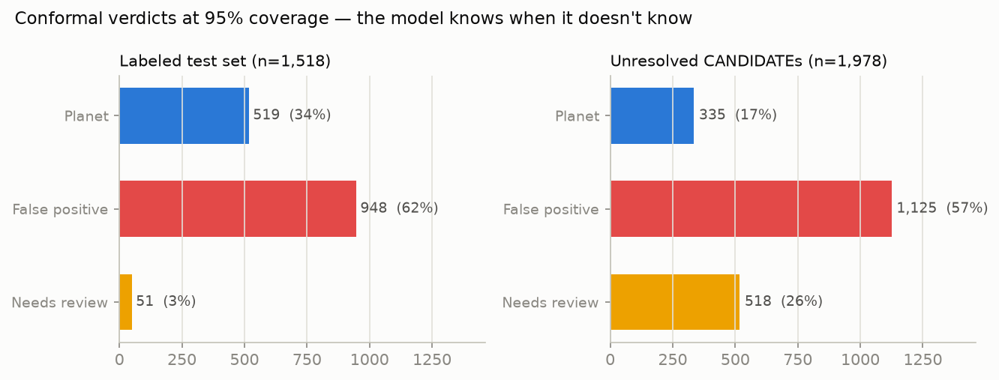

# ExoJury 🪐⚖️

**Every Kepler candidate gets a fair trial: a calibrated verdict, a
statistical guarantee, and a written opinion.**

Entry for the India High School Exoplanet Data Challenge (Celesta).

## TL;DR

- A **leakage-audited** classifier (98.2% honest test accuracy) that proves
  most naive models on this dataset are grading themselves with the answer key
- **Calibrated probabilities** (ECE 0.009) and **conformal prediction sets**
  with a 95% coverage guarantee — the model abstains when the evidence is
  ambiguous instead of guessing
- A **label audit that found real catalog errors**: our model flagged
  "confirmed" planets that NASA itself later demoted — using only this
  dataset, before we ever looked at the literature
- The 1,978 unresolved CANDIDATEs **ranked for follow-up**, 74% of them
  resolved with statistical guarantees
- **AI vetting dossiers** via Featherless.ai: the model decides, the LLM
  narrates
- An interactive **Streamlit mission control** to try any of the 9,564 KOIs

## 1. The problem with 99% accuracy

The KOI cumulative table quietly contains the answer key. `kepler_name`
exists only for confirmed planets. `koi_pdisposition` *is* the pipeline's
verdict. The four `koi_fpflag_*` columns are outputs of NASA's Robovetter —
set *after* classification. Two lines of code using those columns score
**99.96% with zero machine learning**:



ExoJury therefore starts from a strict leakage policy
([src/exojury/config.py](src/exojury/config.py)): every one of the 140
columns is assigned to a documented tier, and everything the vetting process
wrote is excluded. Our accuracy is lower than a leaky model's — **on
purpose** — and it measures something real: what the physics alone can tell
you about a signal.

## 2. Results (held-out test, CONFIRMED vs FALSE POSITIVE)

| Model | ROC-AUC | PR-AUC | F1 | Accuracy | Brier |
|---|---|---|---|---|---|
| **Honest** (physics features only) | 0.9967 | 0.9941 | 0.9754 | 0.9822 | 0.0163 |
| Leaky (adds Robovetter fpflags) | 0.9997 | 0.9996 | 0.9936 | 0.9954 | 0.0029 |

The leaky model looks +1.3 accuracy points better — but those points are
copied from NASA's Robovetter, not learned from the sky. The honest model's
top permutation-importance features are all physics: planet radius
(impossible giants), detection statistic, centroid offsets (background
binaries), transit duty cycle, multiplicity, odd-even depth consistency.

For the challenge's requested 3-class treatment (accuracy 86.1%, macro-F1
0.831): the CANDIDATE class is the weakest (F1 0.68) precisely because
*CANDIDATE is not a kind of object — it's a state of knowledge*. That's why
the rest of the pipeline treats candidates as unlabeled objects to be
scored, not as a class to be imitated.

## 3. Honest uncertainty: calibration + conformal prediction



Isotonic calibration brings expected calibration error to **0.009**. On top
of that, split conformal prediction gives every object a *prediction set*
with a finite-sample **95% coverage guarantee** (empirical: 95.6%). Objects
whose set is empty are handed to a human:



On the labeled test set the pipeline is decisive for 96.6% of objects
(98.9% accurate when decisive). On the genuinely-unresolved CANDIDATE
frontier it abstains 3× more often — the model knows those are harder,
which is exactly what NASA's own vetting concluded by leaving them
unresolved.

## 4. The audit that found real catalog errors 🏆

We used confident learning (cleanlab) to ask: *which labels does the
out-of-fold model most confidently disagree with?* The top hits, checked
against the literature **after** the model flagged them:

| KOI | Catalog says (our snapshot) | Model says | Literature says |
|---|---|---|---|
| K01450.01 (Kepler-854 b) | CONFIRMED | p(planet) = 0.00003 | **Demoted to false positive** — mass > 30 M_Jup ([Niraula et al. 2022](https://exoplanetarchive.ipac.caltech.edu/overview/Kepler-854b)) |
| K01416.01 (Kepler-840 b) | CONFIRMED | p(planet) = 0.0016 | **Demoted to false positive** — same study |
| K07016.01 (Kepler-452 b) | CONFIRMED | p(planet) = 0.0006 | Validation formally disputed ([Mullally et al. 2018](https://arxiv.org/abs/1803.11307); [NASA statement](https://exoplanetarchive.ipac.caltech.edu/docs/kepler452b.html)) |
| K03794.01 (Kepler-1520 b) | CONFIRMED | p(planet) = 0.003 | Real planet, but *disintegrating* — dusty variable transits break the standard fit; an honest miss |

A high-school-scale pipeline, given only this CSV, independently
rediscovered demotions that took the field years — because it was built to
distrust labels, not just fit them. Full list: `reports/label_audit.csv`
(46 flags, 0.6% of labeled rows).

## 5. The frontier: 1,978 unresolved candidates, ranked

`reports/candidate_scores.csv` scores every CANDIDATE with a calibrated
probability and a conformal verdict: **335 planet-like (95% guarantee),
1,125 false-positive-like, 518 need human review**. Sorted by calibrated
probability, this is a telescope-time priority list.

## 6. AI vetting dossiers (Featherless.ai)

For any KOI, an LLM (DeepSeek-V3 via the sponsor's OpenAI-compatible API)
writes a three-part astronomer-style report — SIGNAL / ASSESSMENT /
FOLLOW-UP — grounded strictly in the numbers the pipeline computed. **The
sklearn model decides; the LLM only narrates.** Pre-generated dossiers for
15 showcase objects live in `reports/dossiers/`.

## 7. Mission control

```bash
streamlit run app/dashboard.py
```

Pick any KOI → calibrated probability, conformal verdict, physical
evidence, AI dossier. Browse the ranked frontier. Inspect the label audit.

## Reproduce everything

```bash
python -m venv .venv && source .venv/bin/activate
pip install -r requirements.txt
export PYTHONPATH=src
python -m exojury.eda             # figures 01-04
python -m exojury.train_baseline  # honest vs leaky baseline
python -m exojury.calibrate       # calibration + conformal + frontier scores
python -m exojury.audit           # cleanlab label audit
python -m exojury.three_class     # challenge-required 3-class metrics
python -m exojury.figures_stage2  # figures 06-07
# optional, needs FEATHERLESS_API_KEY in .env:
python -m exojury.dossier --batch # AI vetting dossiers
```

Data: `data_raw/KOI_Cumulative_clean.csv` — NASA Exoplanet Archive KOI
cumulative table (DOI 10.26133/NEA4), provided by the challenge. Data by the
NASA Exoplanet Science Institute at IPAC/Caltech.
